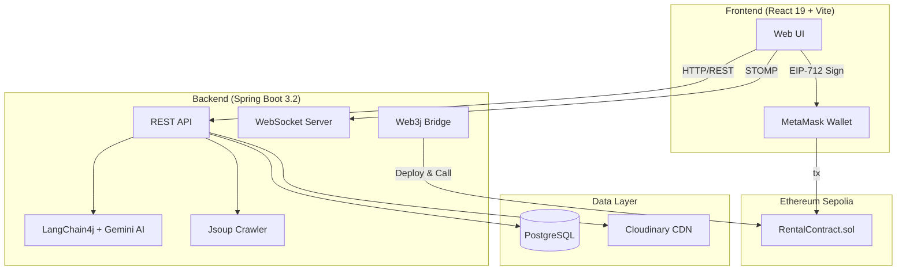

<div align="center">

# 🏠 SmartRental

**Blockchain-Powered Rental Management Platform with AI Integration**

[](https://openjdk.org/)
[](https://spring.io/projects/spring-boot)
[](https://react.dev/)
[](https://soliditylang.org/)
[](https://www.typescriptlang.org/)
[](https://www.postgresql.org/)

A full-stack platform connecting landlords and tenants with **immutable smart contracts on Ethereum (Sepolia)**, **AI-powered chatbot via Gemini**, and **real-time notifications** — built as a graduation thesis project at IUH.

</div>

---

## ✨ Key Features

| Feature | Description |
|---------|-------------|
| 📝 **Smart Contract Leases** | Rental agreements deployed on Ethereum Sepolia — immutable, transparent, and verifiable on-chain |
| 🤖 **AI Chatbot (RAG)** | In-memory vector store + LangChain4j + Gemini 2.5 Flash for intelligent Q&A about listings and contracts |
| 🗺️ **Interactive Map Search** | Browse rooms with Leaflet maps — filter by location, price, amenities |
| 🌐 **360° Virtual Tours** | Panoramic room previews powered by Pannellum — tour rooms without visiting |
| 💳 **On-chain Payments** | Monthly bills, deposits, and penalties handled through smart contracts with pull-payment pattern |
| ⚖️ **Dispute Resolution** | On-chain dispute workflow with evidence hashing and admin arbitration |
| 🔔 **Real-time Notifications** | WebSocket (STOMP) push notifications for contract events, bills, and messages |
| 🔐 **Security** | JWT + Google OAuth2 + Spring Security + EIP-712 signature verification |
| 🕷️ **Data Crawler** | Auto-crawl listings from major real estate websites using Jsoup |

---

## 🏗 System Architecture



---

## 🔗 Smart Contract Highlights

The [`RentalContract.sol`](contracts/RentalContract.sol) (595 lines) implements a full lease lifecycle:

```
CREATED → LANDLORD_SIGNED → FULLY_SIGNED → ACTIVE → TERMINATED
                                              ↓
                                           DISPUTE → (resolved) → ACTIVE / TERMINATED
```

- **Security patterns:** ReentrancyGuard, Pausable, Pull-Payment (OpenZeppelin)
- **EIP-712** typed signatures for both landlord and tenant
- **Late penalty** system with configurable rates and caps
- **Emergency withdraw** with 7-day delay for dispute protection
- **On-chain audit** of all billing, payments, and deposit deductions

---

## 🛠 Tech Stack

### Backend
| Category | Technologies |
|----------|-------------|
| **Core** | Java 21, Spring Boot 3.2.3, Spring Security, JWT |
| **Database** | PostgreSQL, Hibernate Envers (Audit Trail) |
| **AI / RAG** | LangChain4j, Gemini 2.5 Flash API, In-Memory Vector Store |
| **Blockchain** | Web3j, Hardhat, Solidity 0.8, OpenZeppelin |
| **Auth** | Google OAuth2, JWT |
| **Email** | Brevo (Sendinblue) API |
| **Infra** | Docker, Cloudinary CDN |

### Frontend
| Category | Technologies |
|----------|-------------|
| **Framework** | React 19, Vite, TypeScript 5 |
| **Styling** | TailwindCSS, Framer Motion |
| **State** | TanStack Query (React Query) |
| **Map / 360°** | Leaflet, Pannellum |
| **Blockchain** | ethers.js, MetaMask |

---

## 📂 Project Structure

```
KLTN_SmartRental/
├── backend/                # Spring Boot API server
│   ├── src/main/java/      # Application source code
│   ├── .env.example        # Backend environment template
│   ├── Dockerfile          # Container configuration
│   └── pom.xml             # Maven dependencies
├── frontend/               # React + Vite web client
│   ├── src/                # Components, pages, hooks
│   ├── .env.example        # Frontend environment template
│   └── package.json        # NPM dependencies
├── contracts/              # Solidity smart contracts
│   └── RentalContract.sol  # Main lease contract (595 lines)
├── hardhat.config.cjs      # Hardhat configuration
└── README.md
```

---

## ⚡ Quick Start

### Prerequisites

- **Java 21** + Maven
- **Node.js 18+** + npm
- **PostgreSQL** running on default port
- **MetaMask** browser extension (for blockchain features)

### 1. Clone the repository

```bash
git clone https://github.com/Hnit04/SmartRental.git
cd SmartRental
```

### 2. Backend Setup

```bash
cd backend
cp .env.example .env
# Edit .env with your database credentials and API keys
mvn spring-boot:run
```

<details>
<summary>📋 Backend Environment Variables</summary>

| Variable | Description |
|----------|-------------|
| `DB_URL` | PostgreSQL JDBC connection string |
| `DB_USERNAME` / `DB_PASSWORD` | Database credentials |
| `JWT_SECRET` | Secret key for JWT token signing |
| `GEMINI_API_KEY` | Google Gemini API key for AI features |
| `BLOCKCHAIN_RPC_URL` | Ethereum RPC endpoint (Sepolia) |
| `BLOCKCHAIN_PRIVATE_KEY` | Deployer wallet private key |
| `CLOUDINARY_*` | Cloudinary CDN credentials |
| `BREVO_API_KEY` | Email service API key |
| `GOOGLE_CLIENT_ID` | Google OAuth2 client ID |

</details>

### 3. Frontend Setup

```bash
cd frontend
cp .env.example .env
# Edit .env with your API URL and blockchain config
npm install
npm run dev
```

### 4. Smart Contract Deployment

```bash
# Start local Hardhat node (for development)
npx hardhat node

# Deploy contracts
npx hardhat run scripts/deploy.js --network localhost
```

---

## 👥 Contributors

| Role | Name | Student ID |
|------|------|-----------|
| **Backend & Blockchain** | Trần Công Tính | 22716181 |
| **Frontend & UI/UX** | Trần Ngọc Hưng | 22711231 |

**Advisor:** ThS. Đặng Thị Thu Hà

**University:** Industrial University of Ho Chi Minh City (IUH) — Class DHKTPM18A

---

## 📄 License

This project was developed as a graduation thesis. All rights reserved.

---

<div align="center">

**Built with ❤️ at IUH — 2026**

</div>